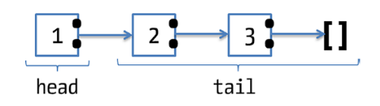
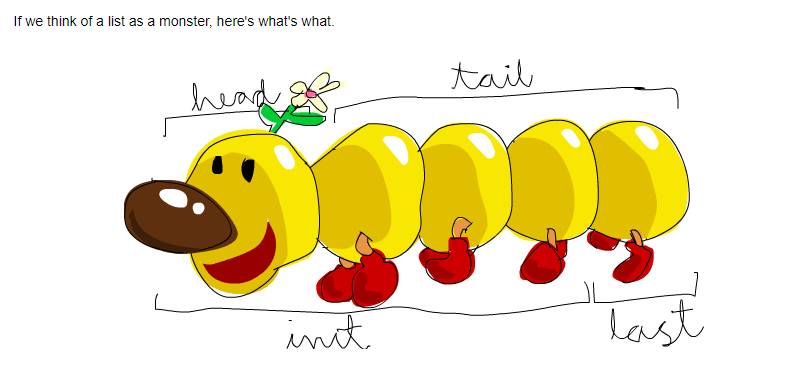

|----------------------------------------------------------------------------------------------------------------------|
|Feature        |Haskell                |Java                    |Python                    |JS                        |
|----------------------------------------------------------------------------------------------------------------------|
|Programming    | Purely functional,    | Primarily OOP,         | Multi-paradigm (supports | Multi-paradigm (supports |
|Paradigm       | declarative, no side  | imperative             | OOP, functional, and     | OOP, functional, and     |
|               | effects               |                        | procedural)              | procedural)              | 
|----------------------------------------------------------------------------------------------------------------------|
|Mutability     | Immutable by default, | Mutable by default,    | Mutable by default,      | Mutable by default,      |
|               | no mutable state      | mutable objects and    | mutable objects and      | mutable objects and      |
|               |                       | variables              | variables                | variables                |
|----------------------------------------------------------------------------------------------------------------------|
| Function as   | Functions are         | Functions are first-   | Yes, functions are first-| Functions are first-class|
| First-Class   | first-class, passed   | class but usually used | class, used like objects | can be assigned to       |   
| Citizen       | around like data      | in an OOP context      |                          | variables and passed as  |   
|               |                       |                        |                          | data                     |
|----------------------------------------------------------------------------------------------------------------------|
|Immutability   | All data is immutable | Data is mutable by     | Data is mutable by       | Data is mutable by       |
|               | unless explicitly     | default                | default                  | default                  |
|               | stated otherwise      |                        |                          |                          |
|----------------------------------------------------------------------------------------------------------------------|
|Type system    | Static typing with    | Static typing with     | Dynamic typing, types    | Dynamic typing, types    |
|               | type inference,       | explicit declarations, | inferred at runtime      | inferred at Runtime      |
|               | strong, no nulls      | uses primitives and    |                          |                          |
|               |                       | objects                |                          |                          |
|----------------------------------------------------------------------------------------------------------------------|
|Type Classes/  | Type classes allow    | Supports generic       | Polymorphism via         | Polymorphism via         |
|Polymorphism   | generic programming   | programming through    | inheritance, dynamic     | prototypes and classes   |
|               | and polymorphism      | templates (Java        | dispatch                 | (ES6 classes)            | 
|               |                       | Generics)              |                          |                          |
|----------------------------------------------------------------------------------------------------------------------|
|Type Checking  | Compile-time type     | Compile-time type      | Runtime type checking    | Runtime type checking    |
|               | checking (strongly    | checking (strongly     | (weakly typed)           | (weakly typed)           |
|               | typed)                | typed)                 |                          |                          |
|----------------------------------------------------------------------------------------------------------------------|
|Generics       | Supports parametric   | Java Generics (compile-| No explicit generics;    | No explicit generics;    |
|               | polymorphism via type | time type safety)      | relies on duck typing    | uses dynamic typing and  |
|               | classes               |                        | (dynamic types)          | prototypal inheritance   |
|----------------------------------------------------------------------------------------------------------------------|
|Syntax         | Concise, based on     | Verbose, curly-braces, | Simple, readable,        | Concise, C-style syntax, |
|               | mathematical notation | explicit declarations  | indentation-based        | flexible but can be      |
|               |                       |                        |                          | confusing                |
|----------------------------------------------------------------------------------------------------------------------|
|Memory         | Automatic garbage     | Automatic garbage      | Automatic garbage        | Automatic garbage        |
|Management     | collection            | collection, manual     | collection               | collection (V8 engine in |
|               |                       | memory management      |                          | browsers, Node.js)       |
|               |                       | possible               |                          |                          |
|               |                       | (Ex: `WeakReference`)  |                          |                          |
|----------------------------------------------------------------------------------------------------------------------|
|Concurrency/   | Supports lightweight  | Multi-threading via    | Multi-threading via      | Asynchronous programming |
|Parallelism    | threads, STM (Software| `Thread`,              | `threading`, `asyncio`   | via callbacks, Promises, |
|               | Transactional Memory) | `ExecutorService`      | for asynchronous I/O     | `async/await`            |
|----------------------------------------------------------------------------------------------------------------------|
|Side Effects   | Side effects handled  | Side effects are       | Side effects allowed     | Side effects allowed     |
|               | using monads (Ex: IO  | natural and prevalent  | naturally, managed by    | naturally, using         |
|               | Monad)                | in programs            | using `async`/`await`    | event-driven programming,|
|               |                       |                        |                          | `async/await`            |
|----------------------------------------------------------------------------------------------------------------------|   
|Lazy Evaluation| Yes, by default       | No, eager evaluation   | No, eager evaluation     | No, eager evaluation     | 
|               | (evaluates only when  |                        |                          |                          |
|               | needed)               |                        |                          |                          |
|----------------------------------------------------------------------------------------------------------------------|
|Garbage        | Yes, via the GHC      | Yes, automatic garbage | Yes, automatic garbage   | Yes, automatic garbage   |
|Collection     | runtime               | collection (GC)        | collection (GC)          | collection (GC)          |
|----------------------------------------------------------------------------------------------------------------------|
|Error Handling | Uses types like       | Try-catch blocks,      | Exceptions with          | Exceptions with          |
|               | `Maybe` and `Either`  | checked exceptions     | `try-except` blocks      | `try-catch` blocks       |
|               | for safe error        |                        |                          |                          |
|               | handling              |                        |                          |                          |
|----------------------------------------------------------------------------------------------------------------------|
|Pattern        | Extensive support,    | Limited support (switch| Limited support (with    | Limited support (via     |
|Matching       | used for function     | statements, instanceof)| `match` in Python 3.10)  | `switch`, and can be     |
|               | decomposition         |                        |                          | mimicked using `if`      |
|               |                       |                        |                          |  statements)             |
|----------------------------------------------------------------------------------------------------------------------|  
|Exception      | Uses types like       | Try-catch blocks for   | Try-except blocks for    | Try-catch blocks for     |
|Handling       | `Maybe` and `Either`, | handling errors        | handling errors          | handling errors          |
|               | no traditional        |                        |                          |                          |
|               | exceptions            |                        |                          |                          |
|----------------------------------------------------------------------------------------------------------------------|
|Standard       | Rich in functional    | Extensive, large       | Extensive, large         | Very large ecosystem,    |
|Library        | tools but smaller than| ecosystem of libraries | ecosystem with           | especially for web and   |
|               | Java/Python           |                        | libraries for many       | front-end development    |
|               |                       |                        | domains                  |                          |
|----------------------------------------------------------------------------------------------------------------------|
|Memory         | Highly efficient due  | Efficient but may      | Less memory efficient,   | Efficient for web apps   |
|Efficiency     | to laziness and       | require optimization   | but easy to manage       | and I/O-bound tasks      |
|               | immutability          | for large systems      |                          |                          |
|----------------------------------------------------------------------------------------------------------------------|
|Compilation    | Compiled to machine   | Compiled to bytecode   | Interpreted, can be      | Interpreted (in browser  |
|               | code via GHC (Glasgow | and runs on JVM        | compiled to bytecode (via| and Node.js, or compiled |
|               | Haskell Compiler)     |                        | `pyinstaller`)           | to bytecode for Node.js) |
|----------------------------------------------------------------------------------------------------------------------|
|Interpreted or | Compiled              | Compiled (to bytecode  | Interpreted (though also | Interpreted (though can  |
|Compiled       |                       | for JVM)               | compiled to bytecode)    | be compiled to bytecode  |
|               |                       |                        |                          | in Node.js)              |
|----------------------------------------------------------------------------------------------------------------------|
|Error Reporting| Type system helps     | Compile-time type      | Run-time errors are      | Run-time errors are      |
|               | catch many errors at  | checks, run-time       | common due to dynamic    | common, exceptions caught|   
|               | compile-time          | exceptions             | typing                   | using `try-catch`        |
|----------------------------------------------------------------------------------------------------------------------|
|Community &    | Smaller but growing,  | Large and mature       | Large and diverse, widely| Extremely large          |
|ecosystem      | strong academic       | in enterprise          | used in data science, web| ecosystem, dominant in   |
|               | presence              | ecosystem, widely used | development, scripting   | web development, both    |
|               |                       |                        |                          | frontend and backend     |
|----------------------------------------------------------------------------------------------------------------------|
|Performance    | Generally high        | Generally high         | Slower than Java due to  | Fast for web             |
|               | performance, but can  | performance, especially| dynamic typing,          | applications, optimized  |
|               | be slower in some     | for large-scale        | interpreted nature       | for asynchronous I/O     |
|               | cases due to laziness | enterprise apps        |                          | (Ex: Node.js)            |
|----------------------------------------------------------------------------------------------------------------------|
|Popular        | Yesod, Snap, Hakyll   | Spring, Hibernate,     | Django, Flask, FastAPI,  | React, Angular, Vue.js,  |
|Frameworks     |                       | JavaFX                 | TensorFlow, PyTorch      | Express.js               |
|----------------------------------------------------------------------------------------------------------------------|
|Development    | Slower, due to strict | Moderate, especially   | Fast, due to simplicity  | Very fast for web apps,  |
|Speed          | type system and       | with verbose code      | and rich ecosystem       | especially with          |
|               | functional nature     |                        |                          | frameworks like React/   |
|               |                       |                        |                          | Express                  |
|----------------------------------------------------------------------------------------------------------------------|
|Tooling & IDE  | Good tooling in IDEs  | Excellent tooling and  | Excellent tooling and IDE| Excellent tooling and IDE| 
|Support        | like IntelliJ,        | IDE support (IntelliJ, | support (PyCharm, VSCode)| support (VSCode,         |
|               | Haskell Language      | Eclipse)               |                          | WebStorm)                |
|               | Server                |                        |                          |                          |
|----------------------------------------------------------------------------------------------------------------------|   
|Cross-platform | Yes, can run on many  | Yes, via JVM (write    | Yes, cross-platform,     | Yes, cross-platform      |
|               | platforms via GHC     | once, run anywhere)    | especially with          | (browsers, Node.js for   |
|               |                       |                        | frameworks like Flask/   | server-side)             |
|               |                       |                        | Django                   |                          |
|----------------------------------------------------------------------------------------------------------------------|
|Learning Curve | Steep due to          | Moderate, object-      | Low, easy to pick up,    | Moderate, easy to start  |
|               | functional nature and | oriented with verbose  | readable syntax          | with, but can become     |
|               | purity                | syntax                 |                          | complex with asynchronous|
|               |                       |                        |                          | programming              |
|----------------------------------------------------------------------------------------------------------------------|

# WHat is Haskell?
    # Haskell is a purely functional programming language. That is for a given input, the output remains the same. No mutations of input takes place.
    # While we can write pure functions in other languages too, in Haskell, data is immutable by default. This means that once a value is assigned, it cannot be changed (For context, in Java only strings are immutable).
    # In Haskell, everything is a pure function. Even operations that seem inherently impure, like reading a file or generating a random number, are expressed in a functional way using monads like IO. This guarantees that functions remain pure, and side effects are isolated and controlled.

# Glasgow Haskell Compiler (GHC):   
    # It is official compiler for Haskell
    # Haskell is both a compiled and interpreted language, depending on how you use it.
        # The primary way Haskell code is executed is through compilation using GHC. They typically have high performance and can run independently without relying on an interpreter.
            # Compile: ghc fileName or ghc fileName -o newFileName
                # newFileName is the name of the compiled file. If not given it will take the same name as the fileName in which the code is written. 
            # Run: ./fileName
        # Haskell also provides an interactive interpreter called GHCi. It is especially useful during development. However, this method is slower than running a compiled program.
            # 
    # GHCi stands for Glasgow Haskell Compiler interactive. It is the interactive environment or REPL (Read-Eval-Print Loop) provided by the GHC.

# Haskell is lazy
    # Expressions are not evaluated until their result is actually needed. 
    # If an expression is never used, it’s never evaluated.
    # Unless specifically told otherwise, Haskell won't execute functions and calculate things until it's really forced to show you a result. 
    # This is different from eager evaluation, where every expression is evaluated as soon as it is encountered.
    # If a function's output is not required, Haskell will not compute its result. Instead, it creates a "thunk," which is a deferred computation. Memory is only allocated for these thunks, and not for the actual result, until the function is invoked.
    # Example: Lets there is a list (an array) xs = [1,2,3,4,5,6,7,8,9] which needs to be doubled 3 times using a function called 'doubleMe'. So we can call the function 'doubleMe' thrice.
        # Imperative langauges: 
            # When you write doubleMe(doubleMe(doubleMe(xs))), the entire list is processed three times
                # The first pass doubles [1, 2, 3, ...] to [2, 4, 6, ...].
                # The second pass doubles [2, 4, 6, ...] to [4, 8, 12, ...].
                # The third pass doubles [4, 8, 12, ...] to [8, 16, 24, ...]. 
        # Lazy Languages (Haskell):
            # Haskell doesn't immediately calculate the results of each doubleMe. Instead, it creates a 'chain of transformations' that will be applied to the elements of xs only when needed. I
            # That is Each element is computed exactly once and only when it's explicitly requested (e.g., when we print the result).
            # Here the entire list processed only once unlike imperative langauges where it is processed thrice.
            # Even though you conceptually apply doubleMe three times, Haskell does not pass through the entire list three times. It evaluates each element once, as it's needed, and carries the intermediate results forward lazily.
    
# Haskell is statically typed
    # Variable types are determined at compile time, rather than at runtime. 
    # So far with statically typed langauges we explicitly specify the data types. But Haskell uses a powerful type inference system (based on the Hindley-Milner algorithm) to deduce the types of variables and functions automatically.
    # Even if we don't specify the types explicitly, the compiler can infer them based on the expressions we write. 
    # Types can be mentioned explicitly too. We use double colon (::)
         # Example1: 
            x :: Integer
            x = 1
        # Example2: 
            y :: Bool
            y = True
        # Example3:
            functionName :: Integer -> Integer -> Integer -> Bool
            functionName min max x = x >= min && x <= max

# Characters/Numbers/Strings
    # To perform operations on a char using predefined functions, 'import Data.Char'
    # To perform operations on a number with ratios, 'import Data.Ratio'  
        # Example1: ghci> 1 % 2 + 1 % 3  outputs as 5 % 6 (Here dont think them as modulo. Just think as '/')
        # Example2: ghci> fromRational(5%6) outputs as 0.8333333333333334
        # Example3: ghci> toRational(0.8333333333333334) outputs as 7505999378950827 % 9007199254740992
            # As you can see from the examples, perfect round-tripping between rational and floating-point values is not always possible.
    # Strings are list of characters. (Just like we say Strings are array of characters in Java)
        # "hello" is just syntactic sugar for ['h','e','l','l','o']

# Functions:
    # Syntax: functionName arg1 arg2...argn = expression
        # Here expression is the function definition and as we know expression results into a single value. It means expression is what gets returned.
        # Even though Haskell has separate return, it is not same as the return statement as in imperative langauges.
    # Here as functionName and each of the parameteres are separated by space
    # Examples with predefined functions:
        1. succ 8 will give the ouput as 9
            # The succ function takes anything that has a defined successor and returns that successor. 
        2. min 9 10 will give the output as 9 (only two inputs are possible)
        3. max 100 101 will give the output as 101 (only two inputs are possible)
        4. div 92 10 will give the output as 9. But for better readability what can we do is 92 `div` 10
    # Function application (calling a function by putting a space after it and then typing out the parameters) has the highest precedence of them all. What that means for us is that these two statements are equivalent.
        # succ 9 + max 5 4 + 1 will give the ouput as 16  
            # As you can see 4 + 1 is NOT evaluated to 5 as it doesnt have the highest precedence
        # (succ 9) + (max 5 4) + 1 will give the ouput as 
        # succ 9 * 10 will give the ouptut as 100
    # Examples with userdefined functions:
        1. doubleMe x = x + x  
            # doubleMe = function name
            # x = input parameter
            # x + x = function definition
            # So when we call 'doubleMe 2' from, the output will be 4
    # In Haskell functions more than one value can be returned. In OOP languages, doing so would require defining some kind of structure or data type to hold the result. 
    # Executing a function from CLI
        # Open the powershell from the folder where the function is stored
        # :l fileName (Here l means loading the module)
        # :r (When any changes are made to the file, this command will reload the function)
        # :? lists all the commands
        # For multi-line code, :{code that can span for multiple lines:}
        # :q to leave ghci
Note: All the internal actions of the interpreter (i.e., those that are not functions on any
library) start with a colon.

# if-else:
    # Instead of {} we use 'then'
    # else part is mandatory in Haskell. Because in Haskell every expression and function must return something.
    # In imperative Languages, if is a statement that controls flow but does not return a value but in Haskell, if is an expression that returns a value, so it can be used in any context where a value is expected.
    # Expressions in both the then and else branches of an if statement must have the same data type.

# Comparison operators:
    # While most of them are similar to imperative languages, not equal to is respresented as /= (not as !=)

# Finding the data type:
    # :t element
    # Example1: :t "name" outputs as String (Strictly double quotes for String)
    # Example2: :t 'n' outputs as Char (Strictly single quotes for Char)
    # Example3: :t toUpper (a predefined function) outputs as toUpper :: Char -> Char
        # What it says is 'toUpper' is a function that takes a Char (first) and returns a Char(second)
    # Example4: :t chr  (a predefined function) outputs as chr :: Int -> Char
        # 'chr' is a function that takes an Int and returns a 
    # Example5: :t min (a predefined function) outputs as min :: Integer -> Integer -> Integer
        # Here min takes 2 inputs both of which are Integers and returns an output which is also an integer 
    # Example6: :t 5 outputs as 5 :: Num a => a 
        # Did you see the difference between type of a String and type of a name in the output?
            # :t "name" outputs as String
            # :t 5 outputs as 5 :: Num a => a
        # This is because "name" is a string literal. It can't be anything else. But 5 can be an Int, Float or Double. So it is given a type called "polymorphic type" (The same concept as in Java)
        # So 5 belongs to any type in the Num typeclass
    # Example7: :t 5.0 outputs as 5.0 :: Fractional a => a
    # Example8: :t [1,2,3] outputs as [1,2,3] :: Num a => [a]
    # Example9: :t (++) outputs as (++) :: [a] -> [a] -> [a]
    # Example10: :t or outputs as or :: [Bool] -> Bool
        # or is a function that takes a list of boolean elements and returns true if all are true and returns false if any one element is false
    # Example11: :t and outputs as or :: [Bool] -> Bool

# Checking Typeclass Instances in GHCi:
We can confirm which typeclasses a specific type belongs to by using :info
    # :info Int        -- Shows all typeclasses `Int` belongs to
    # :info Float      -- Shows all typeclasses `Float` belongs to
    # :info Num        -- Lists all types that are instances of `Num`
    # :info Fractional -- Lists all types that are instances of `Fractional`

# lists:
    # In Haskell, lists are a homogenous data structure. That is, they store several elements of the same type. 
    # Lists are the most used data structure in functional programming.
    # Like in most functional languages, lists in Haskell are linked lists.

        # From the above image, you can see that the (:) operator is used to bind together an element with the rest of the list, and you can split those elements apart again using head and tail.
        # Also, you can also see that a list is a series of cons operations that always end with the empty list constructor, [].
    # Accessing an head/tail from an empty will throw an error. Also understand that in Haskell, handling excptions not the preferred way to handle errors. To prevent errors from operations on empty lists, just be sure to check for nonemptiness before applying functions such as head and tail or use pattern matching. 
    # One important thing to remember is that an empty list can be a member of a larger list of lists, so [] and [[]] are not equivalent. The first is a completely empty list of lists, whereas the second is a list that contains only one element, which is an empty list.
    (a) Putting two lists together. This is done by using the concatenation (++) function.
        # Examples: 
            1. ghci> [1,2,3,4] ++ [9,10,11,12] outputs as [1,2,3,4,9,10,11,12]
            2. ghci> "hello" ++ " " ++ "world" outputs as "hello world"
            3. ghci> ['w','o'] ++ ['o','t'] outputs as "woot"
    (b) cons operator (:) is used to put a character/number at the beginning of another list. You cannot use another list or string to prepend.
        # Examples:
            1. ghci> 'A':" SMALL CAT" outputs as "A SMALL CAT"
            2. ghci> 5:[1,2,3,4,5]  outputs as [5,1,2,3,4,5] 
        # Adding a single value at the beginning doesn't require sqaure brackets. But when you are adding it at the end, square brackets are required. 5:[1,2,3,4,5] is same as [5]:[1,2,3,4,5]
        # [1,2,3] is actually just a syntactic sugar for 1:2:3:[]. That to the empty list we are prepending 3 and then 2 and then 1.
        # [] - an empty list, [[]] - a list that contains one empty list, [[],[],[]] -a  list that contains three empty lists.
    (c) removing an element from a list
        # If you want to get an element out of a list by index, use !!
        # ghci> "Steve Buscemi" !! 6 outputs 'B' 
    (d) lists can be compared if the stuff they contain can be compared and they are compared in lexicographical order.
        # Examples:
            1. [3,2,1] > [2,1,0] outputs as true as the first element of list 1 is > than first element of list 2  
            2. [3,2,1] > [2,10,100] outputs as true
            3. [3,2,1] > [3,4,0] outputs as false as the second element of list 1 is < than the second element of list 2 
    (e) head: It accepts a list as the input and returns the first element
        # Example: ghci> head [5,4,3,2,1]  outputs 5  
    (f) tail: It accepts a list as the input and returns everything except its first element.
        # Example: ghci> tail [5,4,3,2,1] outputs [4,3,2,1]
    (g) last: It accepts a list as the input and returns its last element.
        # Example: ghci> last [5,4,3,2,1] outputs 1
    (h) init: It accepts a list as the input and returns everything except its last element.
        # Example: ghci> init [5,4,3,2,1] outputs [5,4,3,2] 

Note: But what happens if we try to get the perform the above functions on an empty list? It will lead to an exception - "Prelude.functionName: empty list"
    (i) length: takes a list and returns its length
        # Example: ghci> length [5,4,3,2,1] outputs as 5
    (j) null: It checks if a list is empty. If it is, it returns true, otherwise it returns false
        # Example: ghci> null [1,2,3] outputs as False  
    (k) reverse: It reverses a list.
        # Example: reverse [5,4,3,2,1] outputs as [1,2,3,4,5] 
    (l) take: It accepts a number and a list as inputs. It extracts that many elements from the beginning of the list. 
        # Example: take 3 [5,4,3,2,1] outputs as [5,4,3] 
    (m) drop: It works in a similar way, only it drops the number of elements from the beginning of a list.
        # Example: drop 3 [8,4,2,1,5,6] outputs as [1,5,6] 
    (n,o) maximum and minimum: Finds the maximum and minimum value from a list
        # Example1: minimum [8,4,2,1,5,6] outputs as 1
        # Example2: maximum [1,9,2,3,4] outputs as 9
    (p,q) sum and product: Finds the sum and product of all the elements in a list
        # Example1: sum [5,2,1,6,3,2,5,7] outputs as 31
        # Example2: product [6,2,1,2] outputs as 24    
    (r) elem: It accepts a value and a list and returns true of the value is present in the list, else it returns false.
    (s) ranges: Separating the first two elements with a comma and then specifying what the upper limit is.
        # Example1: [1..5] outputs as [1,2,3,4,5]
        # Example2: ['a'..'e'] outputs as "abcde"
            # When the increment is just by one number/character we can just use one element (as in example 1 and 2). 
        # Example3: [2,4..10] outputs as [2,4,6,8,10]
        # Example4: [5..1] will output an empty string. You need to mention two elements when in reverse as [5,4..1]
    (t) take: It is used to extract the first n elements from a list
        # Syntax: take :: Int -> [a] -> [a]
            # If number of elements in lists is <= 0, it returns an empty list
            # If number of elements in lists > list's length, it returns the entire list
            # If number of elements in lists is within the range of the list, first n elements are returned
        # Example1: take 3 [1, 2, 3, 4, 5] outputs as [1, 2, 3]
        # Example2: take 10 [1, 2, 3] outputs as [1, 2, 3]
        # Example3: take 0 [1, 2, 3] outputs as []
        # Example4: take (-2) [1, 2, 3] outputs as []
    (u) cycle: Takes a list and cycles it into an infinite list
        # Example1: take 10 (cycle [1,2,3]) outputs as [1,2,3,1,2,3,1,2,3,1]
        # Example2: take 12 (cycle "LOL ") outputs as "LOL LOL LOL "
    (v) repeat: It takes an element and produces an infinite list of just that element. It's like cycling a list with only one element.    
        # Example3: take 10 (repeat 5) outputs as [5,5,5,5,5,5,5,5,5,5]  

# list comprehensions:
    # It provides a concise way to create and manipulate lists.
    # They are inspired by set notation in mathematics and allow you to generate lists based on existing lists, applying transformations and filters.
        # Example for a set: S = {2*x | x ∈ N, x<=10} 
    # Syntax: [expression | qualifiers]
        # expression: Defines how elements in the resulting list are constructed. It transforms or processes elements drawn by the qualifiers. It defines the output for each element that satisfies the conditions in the qualifiers.
        # qualifiers: Includes generators (to draw elements from lists) and guards (boolean conditions to filter elements).
    # Example1: [x*2 | x <- [1..10]]  outputs as [2,4,6,8,10,12,14,16,18,20] 
    # Example2: [x*2 | x <- [1..10], x*2 >= 12]
    # Example3: [x | x <- [50,51..100], x  `mod` 7 == 3]
        # Haskell doesn't uses modulo operator rather it uses `mod` (in backticks when used between operands) or simply use "mod x 7"
    # Example4: boomBang x = [if x > 10 then "BANG" else "BOOM" | x <- [1..20], odd x]
        <!-- Instead of x % 2 == 1, we can simply write odd x -->
    # Nested list comprehensions: 
        # Example: 
            ghci> let xxs = [[1,3,5,2,3,1,2,4,5],[1,2,3,4,5,6,7,8,9],[1,2,4,2,1,6,3,1,3,2,3,6]]  
            ghci> [ [ x | x <- xs, even x ] | xs <- xxs]  
          outputs as [[2,2,4],[2,4,6,8],[2,4,2,6,2,6]]   

# Tuples:
    # A tuple in Haskell is a collection of heterogeneous  elements.
    # Tuples are defined using parentheses () with elements separated by commas.
|----------------------------------------------------------------------------------------------------|
| Feature          | List                                  | Tuple                                   |
|------------------|---------------------------------------|-----------------------------------------|
| Definition       | Ordered collection of elements        | Fixed-size collection of elements       |
| Syntax           | `[1, 2, 3]`                           | `(1, "two", True)`                      |
| Size             | Can hold zero or more elements        | Fixed number of elements                |
| Homogeneity      | All elements must be of the same type | Can hold elements of different types    |
| Access Pattern   | Sequential (via head, tail, etc.)     | Positional (via pattern matching)       |
| Use Case         | Collections of similar data           | Grouping related but different data     |
| Pattern Matching | Can match via cons (`x:xs`)           | Matches exact structure (e.g., `(a, b)`)|
| Example Usage    | `[1, 2, 3]` for numbers list          | `("John", 25)` for name-age pair        |
| Common Operations| `head`, `tail`, `length`, etc.        | Access by deconstructing pattern        |
| Mutability       | Immutable                             | Immutable                               |
| Nesting Allowed? | Yes, lists within lists               | Yes, tuples within tuples               |
| Length Inference | Must be computed (`length list`)      | Known at compile time                   |
| Nesting          | In nested list, the inner list can be | Inner tuple CANNOT be of different      |
|                  | of different lengths.                 | lengths. Also when we have n number of  |
|                  |                                       | tuples inside list and m number of      |
|                  |                                       | elements in each tuple, each element in |
|                  |                                       | the respective tuple must be same type. |
|                  |                                       | Example: (Wrong) [('a', 'b'), (1, 'c')] |
|                  |                                       | This is because list should be          | 
|                  |                                       | homogeneous. First element's type is    |
|                  |                                       | different than the second. So it will   |
|                  |                                       | throw an error. But the same can be     |
|                  |                                       | achieved when we use a tuple inside a   |
|                  |                                       | tuple                                   |
|----------------------------------------------------------------------------------------------------|
    # Like lists, tuples can be compared with each other if their components can be compared. Only you can't compare two tuples of different sizes, whereas you can compare two lists of different sizes.
    # methods:
        (a) fst: takes a pair and returns its first component.
            # Example: fst (8,11) outputs as 8
        (b) snd: takes a pair and returns its second component
            # Example: snd (8,11) outputs as 11
        (c) zip: takes two lists and then zips them together into one list by joining the matching elements into pairs. Ignores the extra elements willout pairs (when two lists are in different size)
            # Example1: zip [1,2,3,4,5] [5,5,5,5,5] outputs as [(1,5),(2,5),(3,5),(4,5),(5,5)]
            # Example2: zip [1 .. 5] ["one", "two", "three", "four", "five"] outputs as [(1,"one"),(2,"two"),(3,"three"),(4,"four"),(5,"five")] 

# Creating a Haskell Project using Stack:
    # stack new projectName; stack build; stack exec projectName-exe
        # Lot of files created just like a react project.
        # projectName.cabal file is significant. It is basically a config file
            # It is composed of series of properties followed by several blocks of code, called stanzas in Cabal terminology, that define the components (libraries and executables) to be built, the source files making each of them, and the options for compilation (such as flags or enabled extensions).
        # Stanza
            # It refers to a section or block of settings that defines a particular. configuration for a component of the project. 
            # Each stanza controls a specific aspect of how the project or module is built. 
            # They are typically written in a key-value format.
    # .cabal file properties
        # exposed-modules: available to anyone who uses your library.
        # other-modules: used internally in your library but are not exposed to users.
        # autogen-modules: utomatically generated during the build process.
        # hs-source-dirs: Specifies the directories where the source files for this component are located.
        # ghc-options: Specifies GHC (Glasgow Haskell Compiler) options.
            # -Wall: Enable all warnings.
            # -Wcompat: Warn about compatibility issues.
            # -Widentities: Warn about redundant type signatures.
            # -threaded: Enables multi-threading.
            # -with-rtsopts=-N: Makes the program use multiple cores.
    # app folder will just have Main.hs file which is the entry point to the program.
    # src folder is where we keep our required modules.
        
# Modules:
    # Haskell projects are built by writing modules
    # Each module will contain a set of definitions, such as functions and data types, and groups them under a common umbrella. The names of modules are nested in a hierarchical fashion
    # They are similar to packages in Java
    # Define each module in its own file
    # module name should be similar to the path name
        # Example: 
            Module: Chapter2.Section2.Example 
            Path: Chapter2/Section2/Example.hs
    # A module file should start with a module declaration followed by a module name and 'where' declaration. From the subsequent lines we can write the definition.
        # Example: module Chapter2.Section2.Example where
            # Here Chapter2.Section2.Example is the module name
    # For a module to become a part of the application we should tell Cabal to include the file in our project.
        1. Place the newly created module under library stanza - either as a value of the exposed modules or other modules. 
        2. If it should also be indvidually executable, modify the "hs-source-dirs" property under executables stanza and include 'src' along with 'app'
    

